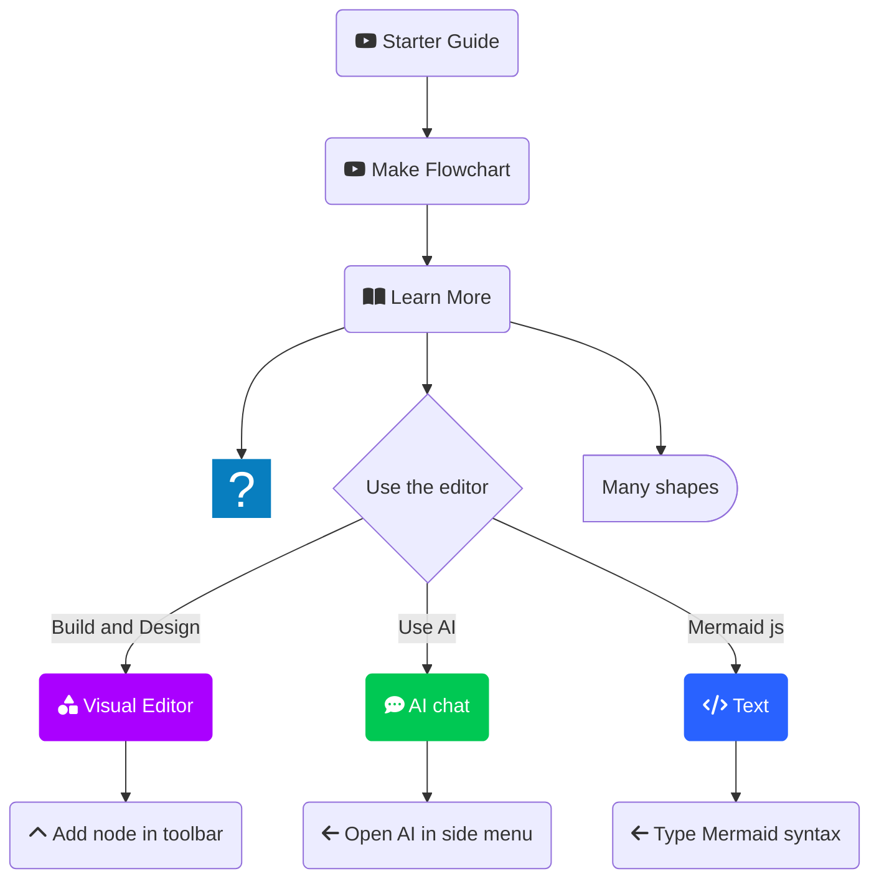

# Diagram Tools

JavaScript based diagramming and charting tool that renders Markdown-inspired text definitions to create and modify diagrams dynamically.

## Mermaid.js

[Mermaid.js](https://mermaid.js.org/) is a JavaScript-based diagramming and charting tool that allows you to create diagrams using a simple text syntax. It's particularly popular for generating flowcharts, sequence diagrams, class diagrams, Gantt charts, and more. The main advantage of Mermaid.js is that it provides a way to create complex diagrams with minimal effort, using easy-to-read and write code.

Code with ` ```mmd`

```mmd
flowchart TD
%% Nodes
    A("fab:fa-youtube Starter Guide")
    B("fab:fa-youtube Make Flowchart")
    n1@{ icon: "fa:gem", pos: "b", h: 24}
    C("fa:fa-book-open Learn More")
    D{"Use the editor"}
    n2(Many shapes)@{ shape: delay}
    E(fa:fa-shapes Visual Editor)
    F("fa:fa-chevron-up Add node in toolbar")
    G("fa:fa-comment-dots AI chat")
    H("fa:fa-arrow-left Open AI in side menu")
    I("fa:fa-code Text")
    J(fa:fa-arrow-left Type Mermaid syntax)

%% Edge connections between nodes
    A --> B --> C --> n1 & D & n2
    D -- Build and Design --> E --> F
    D -- Use AI --> G --> H
    D -- Mermaid js --> I --> J

%% Individual node styling. Try the visual editor toolbar for easier styling!
    style E color:#FFFFFF, fill:#AA00FF, stroke:#AA00FF
    style G color:#FFFFFF, stroke:#00C853, fill:#00C853
    style I color:#FFFFFF, stroke:#2962FF, fill:#2962FF

%% You can add notes with two "%" signs in a row!
```

Visualize with ` ```mermaid`


