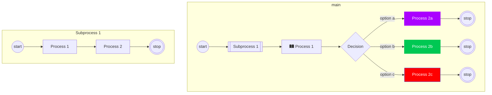

# Diagram Tools

JavaScript based diagramming and charting tool that renders Markdown-inspired text definitions to create and modify diagrams dynamically.

## Mermaid.js

[Mermaid.js](https://mermaid.js.org/) is a JavaScript-based diagramming and charting tool that allows you to create diagrams using a simple text syntax. It's particularly popular for generating flowcharts, sequence diagrams, class diagrams, Gantt charts, and more. The main advantage of Mermaid.js is that it provides a way to create complex diagrams with minimal effort, using easy-to-read and write code.

Code with ` ```mmd`

```mmd
flowchart TD
%% Nodes
  subgraph main 
  start@{shape: 'circle', label: 'start'}
  subprocess1@{shape: 'subprocess', label: 'fa:fa-table-tree Subprocess 1' }
  process1@{shape: 'process', label: 'fa:fa-book-open Process 1' }
  decision@{shape: 'decision', label: 'Decision' }
  process2a@{shape: 'process', label: 'Process 2a' }
  process2b@{shape: 'process', label: 'Process 2b' }
  process2c@{shape: 'process', label: 'Process 2c' }
  stopa@{shape: 'double-circle', label: 'stop'}
  stopb@{shape: 'double-circle', label: 'stop'}
  stopc@{shape: 'double-circle', label: 'stop'}
  end
  subgraph x1subprocess1 [Subprocess 1]
  x1start@{shape: 'circle', label: 'start'}
  x1process1@{shape: 'process', label: 'Process 1' }
  x1process2@{shape: 'process', label: 'Process 2' }
  x1stop@{shape: 'double-circle', label: 'stop'}
  end

%% Edge connections between nodes
  start --> subprocess1 --> process1 --> decision
  decision -- option a --> process2a --> stopa
  decision -- option b --> process2b --> stopb
  decision -- option c --> process2c --> stopc
  x1start --> x1process1 --> x1process2 --> x1stop

%% Individual node styling. Try the visual editor toolbar for easier styling!
  style process2a color:#FFFFFF, fill:#AA00FF, stroke:#AA00FF
  style process2b color:#FFFFFF, stroke:#00C853, fill:#00C853
  style process2c color:#FFFFFF, stroke:#2962FF, fill:#FF0000

%% You can add notes with two "%" signs in a row!
```

Visualize with ` ```mermaid`


